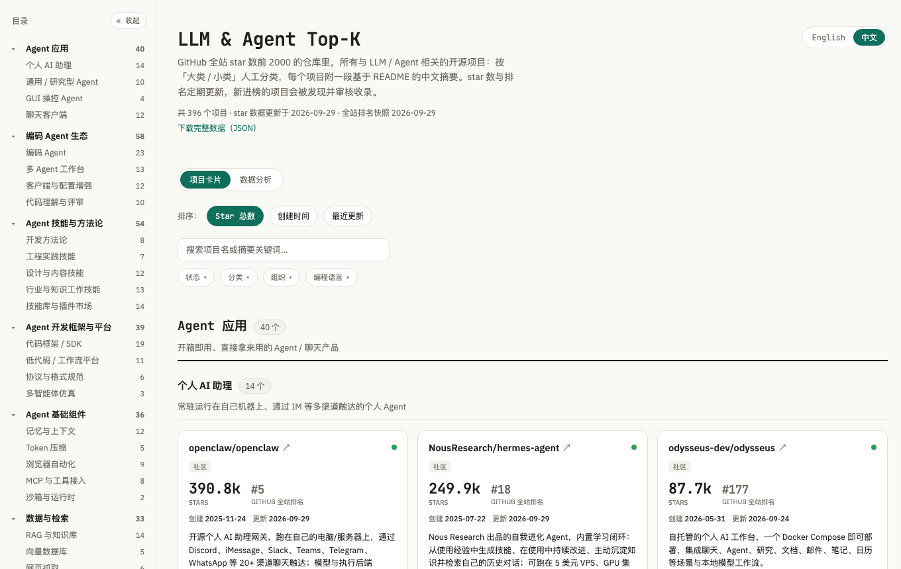
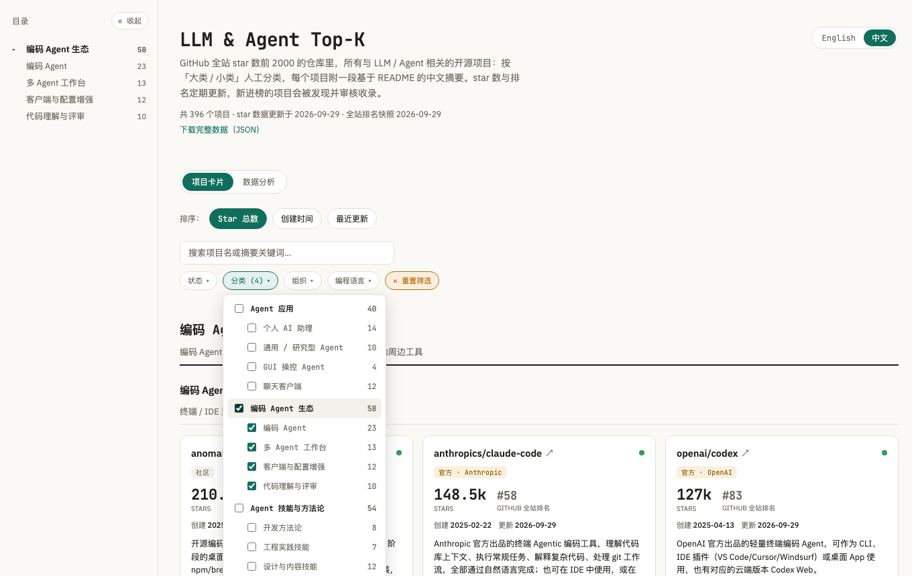
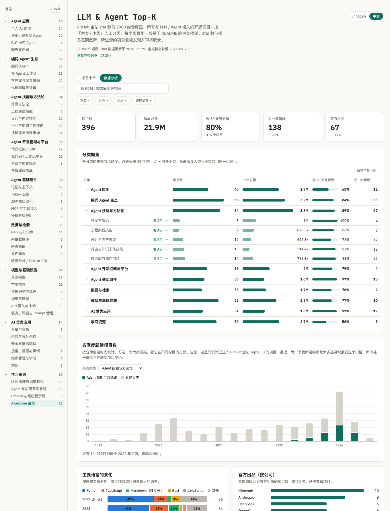

# LLM & Agent Top-K

[](LICENSE)
[](data/LICENSE)

[English](README.md) | **中文**

GitHub 全站 star 排名前 K（当前 K = 2000）的仓库里，所有与 **LLM / Agent** 相关的开源项目，人工整理成一张图谱：两级分类、基于 README 撰写的中文摘要、真实的 GitHub 全站排名。排名和 star 数定期更新，新进榜的项目会被发现并审核。

**在线看板：<https://sigangluo.github.io/github-llm-agent-topk/>**

[](https://sigangluo.github.io/github-llm-agent-topk/)

## 能做什么

- **浏览**：数百个项目按 9 个大类、43 个小类整理，带侧边目录；每个小类都写明了收录边界。
- **看排名**：每个项目都标出它在 GitHub 全站按 star 的真实名次，以及创建时间、最近推送、主要语言、是否已归档。
- **筛选**：按分类树、组织、编程语言、官方 / 社区、活跃度筛选，也可以搜索项目名和摘要。
- **分析**：各分类的规模与活跃度、每季度新建项目数、按创建年份看语言变化、各公司官方出品、高 star 但已经沉寂的项目。
- **切换语言**：整个界面和每一条摘要都有中文和 English 两个版本。
- **复用数据**：[`topk.json`](https://sigangluo.github.io/github-llm-agent-topk/data/topk.json) 包含全部数据；[PROJECTS.zh-CN.md](PROJECTS.zh-CN.md) 是可直接在 GitHub 上浏览的清单。

<table>
<tr>
<td width="50%"><br><sub>两级分类筛选</sub></td>
<td width="50%"><br><sub>数据分析视图</sub></td>
</tr>
</table>

## 收录范围

范围由**排名**决定（前 K 名），而不是作者的口味；是否相关由人工逐个判断，客观数据全部由脚本从 GitHub 拉取。

- **收录**：核心功能与 LLM / Agent 直接相关的项目——模型、训练与推理、Agent 框架与产品、编码 Agent 及周边、技能 / 插件、RAG 与数据工具、以 LLM 为核心的垂类应用，以及相关教程与资源合集。
- **不收录**：纯图像 / 语音 / 视频生成、通用机器学习 / 视觉研究代码、通用基础设施、只是顺带接了点 AI 功能的软件；拿不准的不收。
- **官方 / 社区**：仓库所在的 GitHub 组织就是该公司本身才算「官方」；学术实验室、社区组织、已移交社区维护的项目一律算「社区」。

分类体系和每个小类的边界定义见 [data/taxonomy.json](data/taxonomy.json)。

## 目录结构

```
data/
├── taxonomy.json      两级分类体系（中英双语）              人工维护
├── projects.json      已收录项目：分类、官方/社区、中英摘要   人工维护
├── excluded.json      已审核、判定不相关的仓库               人工审核，脚本写入
├── ranking.json       Top-K 排名快照                        scripts/rank.py 生成
└── candidates.json    新进榜、待审核的仓库                   scripts/candidates.py 生成
scripts/               数据流水线，仅依赖 Python 3.9+ 标准库
site/                  静态看板（纯 HTML / CSS / JS，无构建步骤）
docs/images/           README 截图
PROJECTS.md            英文分类清单（中文版 PROJECTS.zh-CN.md），build.py 生成
```

`projects.json` 每项：`category`（小类 key）、`official`、`officialOrg`、`summary`（中文摘要）、`summary_en`（英文摘要）、`added`（自动填写的收录日期）。star、创建时间、语言、名次等由 `build.py` 补全，不手写。

## 更新数据

由维护者定期手动更新：

```bash
export GH_TOKEN=...                            # 不勾选任何权限的 token 即可
python3 scripts/rank.py                        # 刷新 Top-K 排名（--k 3000 可扩大范围）
python3 scripts/candidates.py                  # 列出待审核仓库（详情在 data/candidates.json）
# 相关的：在 data/projects.json 里加一条
python3 scripts/candidates.py --exclude-rest   # 其余标记为不收录，以后不再出现
python3 scripts/build.py                       # 校验、拉取实时数据、重新生成站点数据和清单
```

只改了分类或摘要、不想联网：`build.py --offline`。

## 本地预览与部署

```bash
python3 -m http.server -d site 8000            # 看板需要静态服务器，双击打开 HTML 读不到数据
```

`site/` 有改动推送到 main 时，`.github/workflows/deploy-pages.yml` 自动发布到 GitHub Pages。fork 后需在 Settings → Pages → Source 选「GitHub Actions」。

## 关于贡献

本项目由维护者个人维护，**不接受 Pull Request**（会直接关闭）。欢迎通过 issue 反馈问题或提出建议，但不保证回复和采纳。你也可以在遵守下方许可证的前提下自由 fork，按自己的口径维护一份。

## 许可证

代码 [MIT](LICENSE)；数据（`data/`、`PROJECTS*.md`、`site/data/`）[CC BY 4.0](data/LICENSE)，使用请注明来源。
